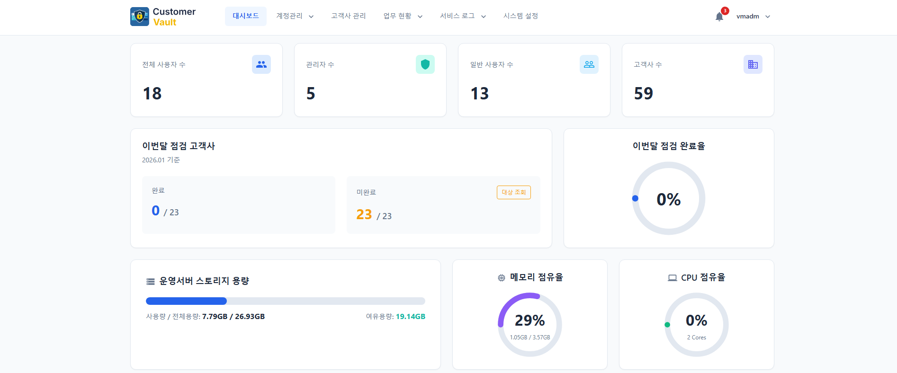

# 고객창고 (Customer Vault)

내부 고객사 관리 및 유지보수 점검 이력 관리를 위한 웹 기반 시스템

## 📖 프로젝트 소개

고객창고는 고객사 정보와 유지보수 점검 이력을 효율적으로 관리하기 위한 웹 애플리케이션입니다. Docker 기반으로 손쉽게 배포하고 운영할 수 있도록 설계되었습니다.

## 🖼️ Preview



## 🛠️ 기술 스택

### Backend


### Database


### Frontend


### Build/Deploy


### 오프라인 환경 지원

이 프로젝트는 **폐쇄망(오프라인) 환경**에서도 정상 작동하도록 설계되었습니다:

- ✅ **외부 CDN 제거**: 모든 리소스가 로컬에서 제공됨
- ✅ **외부 폰트 의존성 제거**: 시스템 기본 폰트 사용 (Apple SD Gothic, Segoe UI, Roboto, Noto Sans KR, Malgun Gothic 등)
- ✅ **Content Security Policy**: Nginx에서 외부 리소스 차단 정책 적용
- ✅ **완전한 자체 포함**: 인터넷 연결 없이 모든 기능 사용 가능

---

## 🚀 빠른 시작

### 1️⃣ 프로젝트 클론

```bash
git clone https://github.com/HelloJamong/customer-vault.git
cd customer-vault
```

### 2️⃣ 환경 변수 설정

```bash
# 환경 변수 파일 생성
cp .env.example .env

# 필요시 .env 파일 수정 (개발 환경은 기본값 사용 가능)
vi .env
```

**서비스 환경에서 반드시 변경해야 할 항목:**

1. **NODE_ENV**를 production으로 변경
```env
NODE_ENV=production
LOG_LEVEL=warn
```

2. **JWT_SECRET** (128자 랜덤 문자열)
- 목적: JWT 서명용 비밀키. 충분히 길고 무작위여야 함.
- 생성 명령:
```bash
node -e "console.log(require('crypto').randomBytes(64).toString('hex'))"
```
  - `randomBytes(64)` → 64바이트(512비트) 무작위 값을 생성
  - `.toString('hex')` → 2배 길이의 128자 16진 문자열로 변환

3. **DB_PASSWORD** (강력한 비밀번호)
- 목적: DB 접속용 비밀번호. 대소문자/숫자/특수문자 포함.
- 생성 명령:
```bash
node -e "
const crypto = require('crypto');
const chars = 'ABCDEFGHIJKLMNOPQRSTUVWXYZabcdefghijklmnopqrstuvwxyz0123456789!@#$%^&*';
let password = '';
for (let i = 0; i < 32; i++) {
  password += chars[crypto.randomInt(0, chars.length)];
}
console.log(password);
"
```
  - 32자리 무작위 문자열 생성
  - 문자 집합에 대문자/소문자/숫자/특수문자를 포함해 복잡도 확보

4. **CORS_ORIGIN** (실제 프론트엔드 도메인)
```env
CORS_ORIGIN=https://yourdomain.com,https://app.yourdomain.com
```
   - 내부망/사설 IP 환경에서 도메인 없이 쓸 경우 예시: `http://10.0.0.5:3003`
   - HTTPS를 쓰지 않는다면 `http://<IP>:<포트>` 형태로 현재 접속에 사용하는 주소를 그대로 넣으면 됨

### 3️⃣ 서비스 실행

**기본 실행 (항상 최신 버전 사용):**
```bash
# Docker Hub에서 최신 이미지 다운로드
docker compose pull

# 서비스 실행
docker compose up -d
```

**특정 버전 고정이 필요한 경우:**
```bash
# .env 파일에 버전 추가
echo "VERSION=2.1.6" >> .env

# 지정한 버전으로 실행
docker compose pull
docker compose up -d
```

**버전 관리 방식:**
- 기본: `latest` 태그 사용 (항상 최신 버전)
- Git 태그 push 시: `latest` + 버전별 태그 생성 (예: `v2.1.7` → `2.1.7` 태그)
- 특정 버전 필요 시: `.env`에 `VERSION=2.1.6` 설정

### 4️⃣ 접속 정보

**최초 로그인 계정:**
- ID: `admin`
- PW: `1111`

---

## 🏗️ 프로젝트 구조
```
customer-vault/
├── backend/                      # Backend 소스 (Docker 이미지로 빌드됨)
├── frontend/                     # Frontend 소스 (Docker 이미지로 빌드됨)
│
├── proxy/                        # Nginx 리버스 프록시 설정
│   └── nginx.conf                # Nginx 설정 파일
│
├── docs/                         # 운영/구성 가이드 문서
│   └── nginx.conf.example        # 외부 Nginx 설정 예시
│
├── data/                         # MariaDB 데이터 볼륨 (영구 저장)
├── uploads/                      # 업로드된 점검서 파일 저장소 (영구 저장)
├── logs/                         # 애플리케이션 로그 파일 (영구 저장)
│
├── docker-compose.yml            # Docker Compose 설정 파일
├── .env                          # 환경 변수 설정
└── .env.example                  # 환경 변수 샘플
```

**주요 디렉토리 설명:**
- `proxy/`: Nginx 컨테이너에서 사용하는 리버스 프록시 설정
- `data/`: MariaDB 데이터베이스 파일이 저장되는 볼륨 (백업 필수)
- `uploads/`: 사용자가 업로드한 점검서 파일이 저장됨 (백업 필수)
- `logs/`: 애플리케이션 로그 파일 (문제 발생 시 확인)
---

## 📚 추가 가이드

- [Docker 설정/권장 사양](docs/docker_setup_guide.md)
- [로그 위치/정책](docs/logs_information.md)
- [DB 테이블 역할](docs/db_information.md)
- [점검서 저장 경로](docs/documents_storage.md)
- [DB 마이그레이션 및 배포](docs/migration_guide.md)
