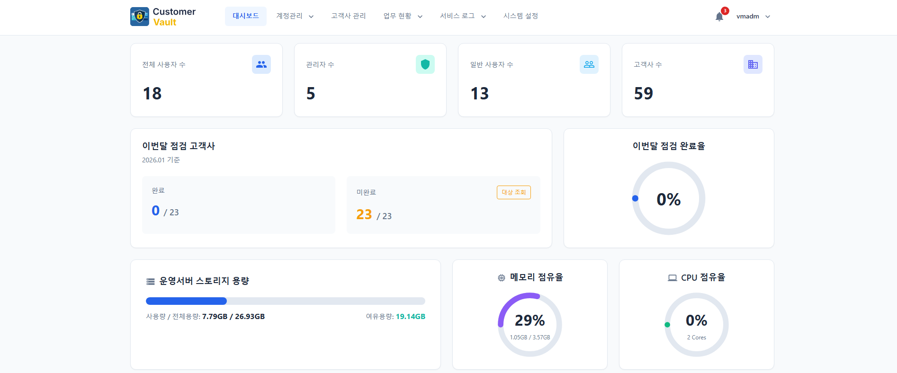

# 고객창고 (Customer Vault)

내부 고객사 관리 및 유지보수 점검 이력 관리를 위한 웹 기반 시스템

## 📖 프로젝트 소개

고객창고는 고객사 정보와 유지보수 점검 이력을 효율적으로 관리하기 위한 웹 애플리케이션입니다. Docker 기반으로 손쉽게 배포하고 운영할 수 있도록 설계되었습니다.

## 🖼️ Preview



## 🛠️ 기술 스택

### Backend


### Database


### Frontend


### Build/Deploy


### 오프라인 환경 지원

이 프로젝트는 **폐쇄망(오프라인) 환경**에서도 정상 작동하도록 설계되었습니다:

- ✅ **외부 CDN 제거**: 모든 리소스가 로컬에서 제공됨
- ✅ **외부 폰트 의존성 제거**: 시스템 기본 폰트 사용
- ✅ **Content Security Policy**: Nginx에서 외부 리소스 차단 정책 적용
- ✅ **완전한 자체 포함**: 인터넷 연결 없이 모든 기능 사용 가능

---

## 🚀 빠른 시작

> Git 클론 없이 배포 파일 두 개만 받아 바로 실행할 수 있습니다.

### 1️⃣ 배포 파일 다운로드

```bash
# 배포 디렉토리 생성
mkdir customer-vault && cd customer-vault

# 최신 릴리즈 배포 파일 자동 다운로드
curl -LO https://github.com/HelloJamong/customer-vault/releases/latest/download/docker-compose.yml
curl -LO https://github.com/HelloJamong/customer-vault/releases/latest/download/.env.example
```

### 2️⃣ 환경 변수 설정

```bash
cp .env.example .env
vi .env
```

**운영 환경에서 반드시 변경해야 할 항목:**

| 항목 | 설명 |
|------|------|
| `NODE_ENV` | `production` 으로 변경 |
| `JWT_SECRET` | 128자 이상 랜덤 문자열 (아래 생성 명령 참고) |
| `DB_ROOT_PASSWORD` | 강력한 DB root 비밀번호 |
| `DB_PASSWORD` | 강력한 DB 사용자 비밀번호 |
| `CORS_ORIGIN` | 실제 접속 도메인 또는 IP (예: `http://10.0.0.5:3003`) |
| `VERSION` | 다운로드한 버전과 동일하게 설정 (예: `26.03.03`) |

```bash
# JWT_SECRET 생성
node -e "console.log(require('crypto').randomBytes(64).toString('hex'))"
```

### 3️⃣ 서비스 실행

```bash
docker compose pull
docker compose up -d
```

### 4️⃣ 접속 정보

**최초 로그인 계정:**
- ID: `admin`
- PW: `1111`

> ⚠️ 최초 로그인 후 반드시 비밀번호를 변경하세요.

---

## 🔄 업그레이드

```bash
# 최신 docker-compose.yml 다운로드
curl -LO https://github.com/HelloJamong/customer-vault/releases/latest/download/docker-compose.yml

# .env의 VERSION을 최신 버전으로 업데이트 (Releases 페이지에서 확인)
vi .env

# 이미지 pull 및 재시작
docker compose pull
docker compose up -d
```

---

## 🏗️ 프로젝트 구조
```
customer-vault/
├── backend/                      # Backend 소스 (Docker 이미지로 빌드됨)
├── frontend/                     # Frontend 소스 (Docker 이미지로 빌드됨)
│
├── proxy/                        # Nginx 리버스 프록시 설정
│   └── nginx.conf                # Nginx 설정 파일
│
├── docs/                         # 운영/구성 가이드 문서
│   └── nginx.conf.example        # 외부 Nginx 설정 예시
│
├── data/                         # MariaDB 데이터 볼륨 (영구 저장)
├── uploads/                      # 업로드된 점검서 파일 저장소 (영구 저장)
├── logs/                         # 애플리케이션 로그 파일 (영구 저장)
│
├── docker-compose.yml            # Docker Compose 설정 파일
├── .env                          # 환경 변수 설정
└── .env.example                  # 환경 변수 샘플
```

**주요 디렉토리 설명:**
- `proxy/`: Nginx 컨테이너에서 사용하는 리버스 프록시 설정
- `data/`: MariaDB 데이터베이스 파일이 저장되는 볼륨 (백업 필수)
- `uploads/`: 사용자가 업로드한 점검서 파일이 저장됨 (백업 필수)
- `logs/`: 애플리케이션 로그 파일 (문제 발생 시 확인)
---

## 📚 추가 가이드

- [Docker 설정/권장 사양](docs/docker_setup_guide.md)
- [로그 위치/정책](docs/logs_information.md)
- [DB 테이블 역할](docs/db_information.md)
- [점검서 저장 경로](docs/documents_storage.md)
- [DB 마이그레이션 및 배포](docs/migration_guide.md)
